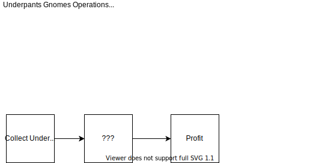

# Business Plan Writing 101

## What Is The Company?
Introduction

1-2 Sentence Pitch

Generate Interest

## Who Am I Giving Money To?
Team / Bio

Sell the team!
* industry experience
* team
* what is interesting / unique?
* sports / interests / skills
* advisory board
* education
* region

## How Does It Work?
Operations / UX

Fronted (What customer sees)

Backend (How it works)

* Before / After your company / service / product
* < 7 Step Process (Broad Strokes)

* Sell Identity
e.g. Brooklyn Brewery sell "Brooklyn"
* Screenshots / UX

## Where Does This Belong?
Marketplace

Be the expert!
* facts / information
* Where does this need to be?
* What are you doing to build?
  * e-mails you've sent to potential customers, FOMO!
  * interviews with industry experts
* What would you do with $1M to grow the company?
* Simple!
* Get customer validation

## Why Hasn't This Been Done?
Competition

Brand / Location / Price / Facts

Even include potential competitors (industry competitors)

Did another company try this and fail?

## How Quickly Will I Know If I Make Or Lose Money?
Market Strategy / Roadmap

How will you make money?

What are your costs?

Broad strokes, more detailed financials in future conversations

## What Are The Numbers?
Revenues

Core Revenue Streams

Potential Ancillary Revenue Streams

## How Much Do You Need?
The Ask

Raise Capital
* "Raising $400k for next 18 months of company life. We are looking to acieve these 3 things mentioned in the roadmap"
* Don't customize each ask!
* "Raising $600k in pockets of $25k"
* Don't worry about valuation in plan
* Can talk more details later in negotiation